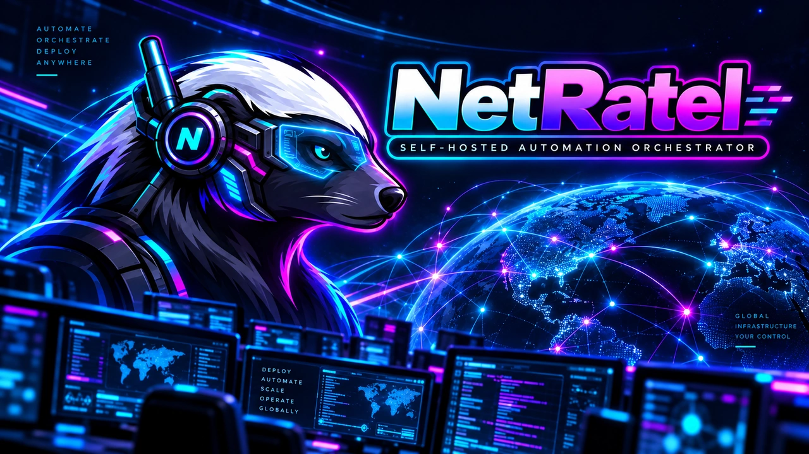

# NetRatel

NetRatel is a self-hosted application for managing computers and automating
work across them. Connect machines, view their status, run scripts and jobs,
open remote terminals, browse files, and inspect logs from one web interface.

Built with .NET and Akka.NET for real-time coordination, NetRatel includes an
API, command-line tools, a native Client/agent, and optional Model Context
Protocol (MCP) integrations. AI services are optional and are not required for
normal operation.

> Prerelease candidates are evaluation builds. Do not use them as a stable
> channel or for unattended fleet updates. The product version is set in
> `Directory.Build.props`.

## Get started

The normal install uses the published image bundle, bundled PostgreSQL, and
local accounts. Open the [verified prerelease assets](https://github.com/BostonTechnologies/netratel/releases)
for the version you intend to run; download its Compose archive and
`SHA256SUMS` together. From the extracted archive, copy `.env.images.example`
to `.env`, set a strong `POSTGRES_PASSWORD`, and keep the approved image digests
from that release. Create the initial agent-signing key and start the stack:

```sh
sha256sum -c --ignore-missing SHA256SUMS
mkdir netratel-instance
tar -xzf netratel-compose-*.tar.gz -C netratel-instance
cd netratel-instance
cp .env.images.example .env
# Edit .env: set POSTGRES_PASSWORD and use the verified image digests.
umask 077
openssl ecparam -name prime256v1 -genkey -noout -out .netratel-agent-es256-private.pem
sudo chown 1654:1654 .netratel-agent-es256-private.pem
sudo chmod 600 .netratel-agent-es256-private.pem
docker compose --env-file .env -f compose.images.yaml config --quiet
docker compose --env-file .env -f compose.images.yaml up -d
docker compose --env-file .env -f compose.images.yaml ps -a
```

The migrations container must exit successfully. Open
**http://127.0.0.1:8080** on the Docker host. No OIDC provider or default
administrator password is needed for this local first run.

### First login

Open NetRatel and follow the setup screen. In the **API container console**, run:

```sh
cat /var/netratel/bootstrap/setup-proof
```

Paste the displayed setup code into the wizard, then choose your administrator
email and passphrase. Those are your sign-in details. There is no default
administrator password.

From the **Docker host** with the extracted release recipe, use:

```sh
docker compose --env-file .env -f compose.images.yaml exec -T api \
  cat /var/netratel/bootstrap/setup-proof
```

For the source recipe, run this on the Docker host:

```sh
docker compose exec -T api cat /var/netratel/bootstrap/setup-proof
```

In a managed API container console, use only the `cat` command above. For
Docker without Compose, identify the API container with `docker ps`, replace
`your-api-container-name` with its actual name, then run on the host:

```sh
API_CONTAINER=your-api-container-name
docker exec "$API_CONTAINER" cat /var/netratel/bootstrap/setup-proof
```

If the file is missing or the code was used, run `dotnet
NetRatel.API.dll --setup-status` inside the API container. [First-run
setup](docs/FIRST_RUN_SETUP.md) explains the result and recovery path.



## Components

- **Web** provides the browser interface and authenticated operator sessions.
- **API** owns durable PostgreSQL state, authorization, and the agent gateway.
- **CLI**, **stdio MCP**, and **HTTP MCP** provide separately authorized
  automation interfaces.
- **Client** is the native agent installed on managed machines.

## Self-hosting

The documented deployment uses PostgreSQL, either bundled or external.
Persist Data Protection and agent-signing material outside the container
filesystem. A fresh local installation can use its built-in local accounts with
no external identity provider; configure OIDC only for an optional OIDC or
hybrid deployment. Supply all secrets at deployment time; the tracked
configuration contains only reserved example values.

Read [self-hosting](docs/SELF_HOSTING.md) before deployment. Obtain the public
release bundle only from the matching prerelease and verify its checksums;
the bundle supplies immutable image digests only after promotion has completed.
See [supported platforms](docs/SUPPORTED_PLATFORMS.md) for the release
matrix and its explicit non-goals.

Useful references: [architecture](docs/ARCHITECTURE.md),
[configuration](docs/CONFIGURATION.md), [CLI and MCP](docs/CLI_AND_MCP.md),
[Native Client](docs/CLIENT.md), [development and testing](docs/DEVELOPMENT.md),
[troubleshooting](docs/TROUBLESHOOTING.md), and
[release engineering](docs/RELEASES.md). The generated [API reference](docs/API_REFERENCE.md)
is available at `/api/docs/` on a running deployment.

## Development

The repository pins its SDK in [global.json](global.json). Restore, build, and
test with:

```sh
dotnet restore NetRatel.sln
dotnet build NetRatel.sln --configuration Release --no-restore
dotnet test NetRatel.sln --configuration Release --no-build
```

`tools/ci/verify-product-version.sh` verifies that all first-party projects
evaluate to the release-manifest version.

## Contributing and security

See [CONTRIBUTING.md](CONTRIBUTING.md), [CODE_OF_CONDUCT.md](CODE_OF_CONDUCT.md),
and [SECURITY.md](SECURITY.md). NetRatel is licensed under Apache-2.0; see
[LICENSE](LICENSE) and [NOTICE](NOTICE).
