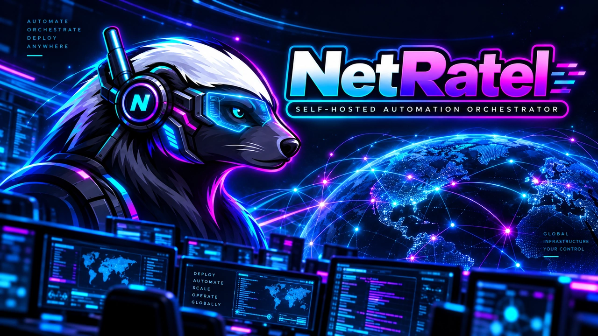

# NetRatel

> [!WARNING]
> 🟠 **Early development:** NetRatel is under active development. Features and
> installation behavior may change, and prerelease builds can contain defects.
> Evaluate RC.17 on disposable systems before using it on managed machines.



NetRatel is a self-hosted application for managing computers and automating
work across them. Connect machines, view their status, run scripts and jobs,
open remote terminals, browse files, and inspect logs from one web interface.

Built with .NET and Akka.NET for real-time coordination, NetRatel includes an
API, command-line tools, a native Client/agent, and optional Model Context
Protocol (MCP) integrations. AI services are optional and are not required for
normal operation.

> Prerelease candidates are evaluation builds. Do not use them as a stable
> channel or for unattended fleet updates. The product version is set in
> `Directory.Build.props`.

## Components

- **Web** provides the browser interface and authenticated operator sessions.
- **API** owns durable PostgreSQL state, authorization, and the agent gateway.
- **CLI**, **stdio MCP**, and **HTTP MCP** provide separately authorized
  automation interfaces.
- **Client** is the native agent installed on managed machines.
- **RatelDesk connector** provides tenant-scoped protected configuration and
  preview for monitoring flows; see [Monitoring flows](docs/FLOWS.md).

## Self-hosting

The documented deployment supports PostgreSQL for durable multi-instance
application data and a single-node SQLite profile for smaller local installs.
Persist Data Protection and agent-signing material outside the container
filesystem. A fresh local installation can use its built-in local accounts with
no external identity provider; configure OIDC only for an optional OIDC or
hybrid deployment. Supply all secrets at deployment time; the tracked
configuration contains only reserved example values.

Read [self-hosting](docs/SELF_HOSTING.md) before deployment. Obtain the public
release bundle only from the matching prerelease and verify its checksums;
the bundle supplies immutable image digests only after promotion has completed.
See [supported platforms](docs/SUPPORTED_PLATFORMS.md) for the rc.3 release
matrix and its explicit non-goals.

Useful references: [architecture](docs/ARCHITECTURE.md),
[configuration](docs/CONFIGURATION.md), [CLI and MCP](docs/CLI_AND_MCP.md),
[Native Client](docs/CLIENT.md), [Services inventory](docs/SERVICES.md), [Monitoring](docs/MONITORING.md), [Monitoring flows](docs/FLOWS.md),
[development and testing](docs/DEVELOPMENT.md),
[troubleshooting](docs/TROUBLESHOOTING.md), and
[release engineering](docs/RELEASES.md). The generated [API reference](docs/API_REFERENCE.md)
is available at `/api/docs/` on a running deployment.

## Development

The repository pins its SDK in [global.json](global.json). Restore, build, and
test with:

```sh
dotnet restore NetRatel.sln
dotnet build NetRatel.sln --configuration Release --no-restore
bash tools/ci/run-fast-regressions.sh TestResults/fast
```

`tools/ci/verify-product-version.sh` verifies that all first-party projects
evaluate to the release-manifest version.

Required CI runs fast unit, component and focused API/PostgreSQL regressions
after one restore/build. Full product-pair checks, physical incidents, native
client execution, browser acceptance and deployment/upgrade checks are opt-in
through the manual integration workflow. See [release validation](docs/RELEASES.md)
for selecting one functional suite and interpreting pending owner acceptance.

## Contributing and security

See [CONTRIBUTING.md](CONTRIBUTING.md), [CODE_OF_CONDUCT.md](CODE_OF_CONDUCT.md),
and [SECURITY.md](SECURITY.md). NetRatel is licensed under Apache-2.0; see
[LICENSE](LICENSE) and [NOTICE](NOTICE).
